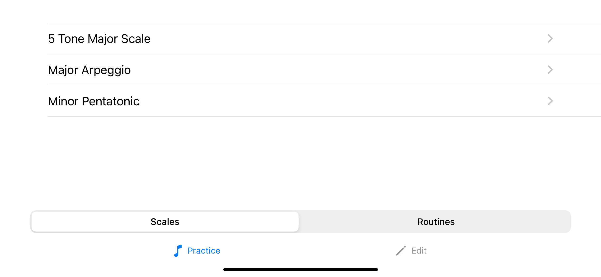
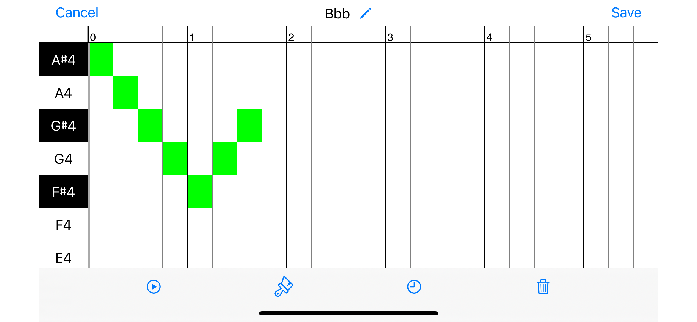
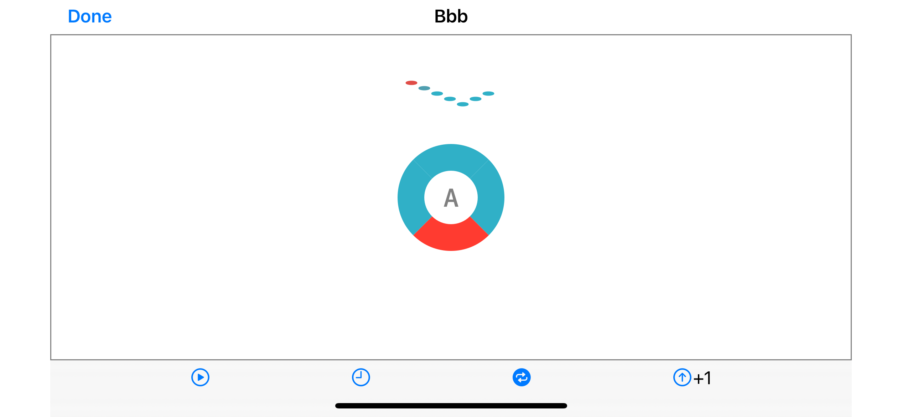

ScalePlayer
====

ScalePlayer is a WIP iOS app to help singers to practice scales and routines.  There are a ton of exisiting similar apps out there, but most of them do not have functionality for building custom routines.

Example screens:
---
---
### Scale list
App supports individual scales which can be organized into routines

---

### Scale editor
App has grid based editing.  Notes can be painted onto the grid.

---

### Scale playback
Playback shows the notes as a contour as well as showing the letter name.  The circle is a beat counter.

---

However, the real purpose of this project is for me to get up-to-date on experience with modern swift and iOS development -- until now most of my iOS development has been objective-C and C++.

Learning Goals
----
- Swift
- MVVM
- Dependency injection in Swift
- Auto Layout
- CoreData
- Unit Testing with Swift

High level decisions
---- 
*iOS 14* -- per [Apple](https://developer.apple.com/support/app-store/), iOS 14 and later accounts for 96% of iOS users and 90% of iPad users. I didn't go to iOS 13 since that would put me > 2 major versions behind iOS 16.

*UIKit vs SwiftUI* -- while SwiftUI is obviously the future, looking at internet articles and job descriptions, UIKit is way more widely used.  SwiftUI also seems to be missing features compared to UIKit.

*MVVM vs alternatives* -- MVVM has the obvious advantages over MVC (e.g. testability).  I saw it referenced in more job descriptions than alternaties like VIPER annd it is easier to implement.  After a bit of coding, I found that I wasn't too happy with navigation/VC creation and ended up going with MVVM-C.

*Storyboards vs programmatic layouts* -- I did play around with Storyboards to get familiar, but went with programmatic layouts because 
1) it gave me a better understanding of auto layout; 
2) Storyboards are bad with source control and teams; 
3) easier to do DI w/o storyboards

Framework decisions
----
### Factory
https://github.com/hmlongco/Factory

I started with manual Dependency Injection, but quickly ran into the annoyance of having to propogate dependencies through the object graph, e.g. in a graph of A->B->C->D, B and C ended up needing to know about dependencies of D even if they didn't use them.

I debated doing my own service locator, but when I looked around I found Factory.  It was lightweight compared to the alternatives, but it also supported property wrappers for initialization, e.g.

    class MyClass {
        @Injected(Container.myDependency) var ids
        ...
    }

This greatly simplified things. It was also easy to provide mocks during testing:

    Container.myDependency.register { MyMockedDependency() }

### Combine
I considered alternatives like RxSwift or ReactiveSwift, but Combine seemed complete and enough and was not third party.

I did use [CombineCocoa](https://github.com/CombineCommunity/CombineCocoa) to help with binding from UIKit -> view model.  I ended up not using it much on this project, but would consider use it or something like it on a form heavy project.

Combine subscriptions are pretty verbose, so I added a couple of extensions to help with readability, e.g. instead of writing:

    class MyViewModel {
        @Published
        var someProperty: String

        ...
    }

    class MyView {
        someViewModel.$someProperty
            .receive(on: DispatchQueue.main)
            .sink { [weak self] val in
                if let self = self {
                    self.someProp = val
                    ...
                }
            .store(in: &subscriptions)
        ...
    }

I could write:

    class MyViewModel {
        @PublishedOnMain
        var someProperty: String

        ...
    }

    class MyView {
        someViewModel.$someProperty
            .assign(to: \someProp, onWeak: self)
            .store(in: &subscriptions)
        ...
    }

I personally found reducing the boilerplate increased the readability/maintainability

### Mockingbird
https://github.com/birdrides/mockingbird

Speaking of mocking, I had success using Mockingbird.  It's pretty feature complete and I found the mocking style to be more readable than the alternatives (this partially ends up being a matter of taste.)

### CoreData
Despite having negative experiences with CoreData in the past, I selected it over something like Realm to do things the Apple way.

I find it annoying that you can't create a temporary object, e.g. any object you create will automatically be persisted on the next NSManagedObjectContext.save() unless you roll it back.  But the bigger annoyances are with the generate code.

In some cases it's impossible to avoid force casts (e.g. for 1-many relationship arrays). And properties can be nullable even when you mark the property as required in the model. It feels like objective-C with a Swift wrapper.

I played around with some alternatives and started to implement them in the app.  Realm improved on some of the CoreData shortcomings, but I dislike the fact that the data persistence lifecycle bleeds into the VCs. And it shares the CoreData shortcoming of requiring model objects to extend a magic object.  
On paper, GRDB fixes all of the above problems:  no magic objects, clear separation of persistence and app logic, clear persistence lifecycle.  However, it requires the developer to do a lot of lifting and has no real opinion about how relationships should be saved -- I couldn't even find reasonable examples in the doc and had to scour github issues (e.g. https://github.com/groue/GRDB.swift/issues/358).  Per the author, the idea is to "Trust SQLite More Than Yourself".  I'm very comfortable with sql databases, but it feels a little dirty exposing other iOS devs to it.  

For now leaving the persistence to CoreData.

### SwiftLint
https://github.com/realm/SwiftLint

Speaking of forced casts, I integrated SwiftLint into my build (which definitely carped about that piece of CoreData sadness).  That resulted in an extended cleanup session, but it's been pretty painless since then.  I do not have the automatic fixing feature turned on.

I did end up running swiftformat manually to handle some automatic cleanups that SwiftLint can't (like fixing lines that are too long).

### TinyConstraints
https://github.com/roberthein/TinyConstraints/

I audited various layout engines like SnapKit, Cartography, and PureLayout. But ultimately, my goal was to become comfortable with auto layout so I eschewed those choices.

However, there is a lot of boiler plate with auto layout.  So I opted for the syntactic sugar that TinyContraints gave.  So instead of writing:

    NSLayoutConstraint.activate([
        view.topAnchor.constraint(equalTo: superview.topAnchor, constant: 0),
        view.leadingAnchor.constraint(equalTo: superview.leadingAnchor, constant: 0),
        view.bottomAnchor.constraint(equalTo: superview.bottomAnchor, constant: 0),
        view.trailingAnchor.constraint(equalTo: superview.trailingAnchor, constant: 0)
    ])

one can write:

    view.edgesToSuperview()

### AVFoundation
For midi playback, Apple provides an implementation using AVFoundation or AudioToolbox. I ended up having to mix the two.

Originally, I wasn't aware there were two options and originally wrote it in AudioToolbox. There seems to be some sort of bug and loading a soundfont took a couple of seconds which resulted in a very poor user experience.

I played around with the third party library, AudioKit, which didn't have the delay problem, but had other weird bugs. I tried to track down the bugs in the AK source code and saw they were using AVFoundation, so decided to roll my own.

I discovered that pre-iOS 16, AVFoundation only allowed playback when the data was loaded from a midi file.  However, it was possible to mix-and-match AVFoundation and AudioToolbox and just use AudioToolbox for the midi track creation.

Apple's documentation for the midi stuff is woefully inadequate. It's very difficult to find people who made it work on the internet. However, one guy, Gene De Lisa, showed up in most of the discussions and provided some helpful hints that helped me keep moving forward, e.g. https://www.rockhoppertech.com/blog/swift-2-avaudiosequencer/

### Peek
I had a need to try to match the style of a UIAlertController (see the SingleValueEditor class).  Peek was a helpful tool to debug/introspect the view of a running app and ended up aiding me with the alert controller.

Additional Notes
----
For the scale editing grid, I used code from [MIDIPianoRollView](https://github.com/cemolcay/MIDIPianoRollView) to do the read-only display and extended it to add editing and playback.  I ended up having to change a lot of it to satisfy SwiftLint as well as to make it more readable, but Cem Olcay did a lot of helpful work there.

Open issues
---
Still largely a toy project.  Added unit tests, but don't have coverage.  Added some mechanisms for handling errors, but didn't go as far as I would in a production project.

No networking. The basic features of this app didn't really warrant it. I started a second project (to graph Habitify data) to get hands on there.

I didn't do anything special with device capabilities, but I did pay attention to safe areas aand was able to verify that the app works on different device sizes/types/orientations.  I verified that dark mode works for everything (after some tweaks) except for the playback screen.  I'm not a designer so I won't pretend I did a good job with UI/UX in general.

